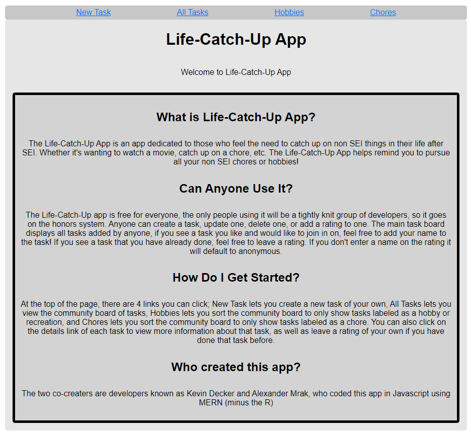
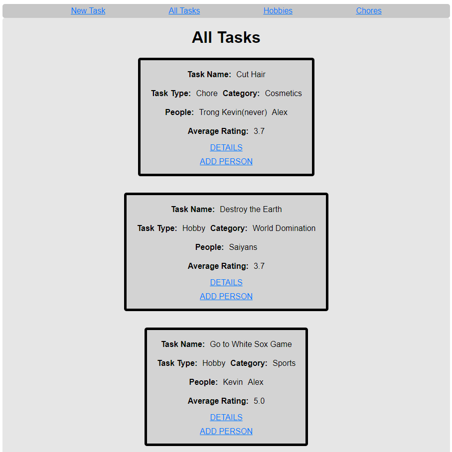
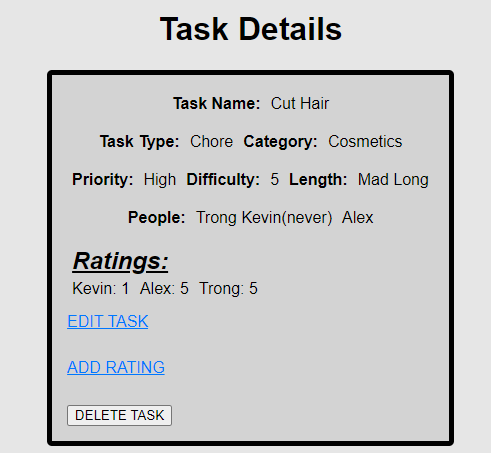

# Life-Catch-Up-Project
The Life Catch Up app is perfect for people who want to catch up on their life after SEIR. Whether you want to remind yourself to watch a certain movie, do a certain chore, or see what other SEIR students have planned, The Life Catch Up app is perfect for all your non SEIR endeavors!

# 
Landing Page:

#
Index View:

#
Show Details:

# Technologies Used
HTML, CSS, Javascript, EJS, Express, MongoDB, Node.js

# Getting Started
Trello Board:
https://trello.com/b/TYRrxZTF/seir-project-2

Link to app: 
https://life-catch-up.herokuapp.com/

# Possible App Features
We would like to implement media responsiveness for those of you on a phone or tablet, and we are also considering the possibility of implementing a user log in feature.
